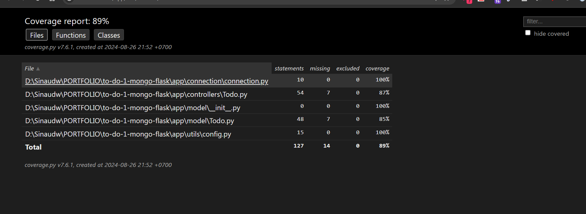
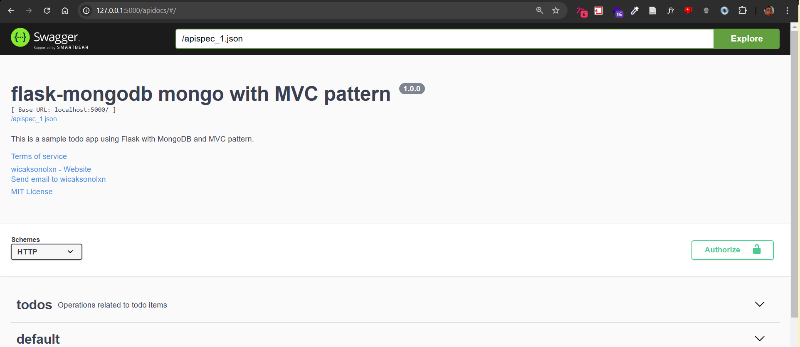

# Flask-mongodb template MVC 
this project is a Template that utilies pymongo and mongodb as the database
## Prerequisites

- **Python 3.11**: This project requires Python 3.11. Make sure you have it installed on your machine.

## Installing Dependencies

### For Pipenv Users

If you prefer using `Pipenv` to manage your virtual environment and dependencies, follow these steps:

1. **Install Python 3.11 and Pipenv**:
   Ensure you have Python 3.11 installed and then install `Pipenv` if you haven't already:
   ```bash
   pip install pipenv
   ```

2. **Create and Activate the Pipenv Environment**:
   Use the following command to create a Pipenv environment with Python 3.11:
   ```bash
   pipenv install --python 3.11
   ```

3. **Install Dependencies**:
   Once the environment is created, install the dependencies listed in the `requirements.txt` file:
   ```bash
   pipenv run pip install -r requirements.txt
   ```

### For Pip Users

If you're using `pip` directly (without Pipenv), follow these steps:

1. **Create a Virtual Environment**:
   Create a virtual environment using Python 3.11:
   ```bash
   python3.11 -m venv venv
   ```

2. **Activate the Virtual Environment**:
   - On Windows:
     ```bash
     venv\Scripts\activate
     ```
   - On macOS/Linux:
     ```bash
     source venv/bin/activate
     ```

3. **Install Dependencies**:
   With the virtual environment activated, install the dependencies using `pip`:
   ```bash
   pip install -r requirements.txt
   ```

## Database Setup

Make sure you have MongoDB installed and running on your machine. You’ll need to configure your connection settings in the application to connect to your MongoDB instance. Lookup `.env.example` as a guide
```
SERVER_USERNAME=user_name
SERVER_PASSWORD=password 
CLUSTER_NAME =your_cluster_name
DB_NAME=your_database_name
SECRET_KEY=Rahasia123!

```

## Running the Application

Once you have installed all dependencies and set up the database, you can run the application:

```bash
pipenv run python index.py
```

or

```bash
python index.py
```

(depending on whether you're using `Pipenv` or `pip`).


# Running pytest for api testing/ unit testing.
go to the test directory then , run this 
naming conventions for pytest you can refer to this [Documentation](https://docs.pytest.org/en/stable/example/pythoncollection.html#changing-naming-conventions)
```py
pytest --cov=your_package_name --cov-report=term-missing

```

example : 
```py
pytest --cov=app --cov-report=html 

```
This checks your coverage then print it to html that you can open using quokka or Live server
This is the example of the output expected in the html 




# Documentation
this template provide documentation using OpenApi's Swagger from the [flasgger library](https://github.com/flasgger/flasgger)

to acess your swagger-UI (view) use acess it through </br>
`{{your_base_url}}/apidocs`

this is what will you expect from acessing it 


## Additional Notes

- If you're contributing to the project, please make sure to follow the same Python version and environment setup to avoid any compatibility issues.
- Feel free to add more instructions based on your project's specific needs. 
